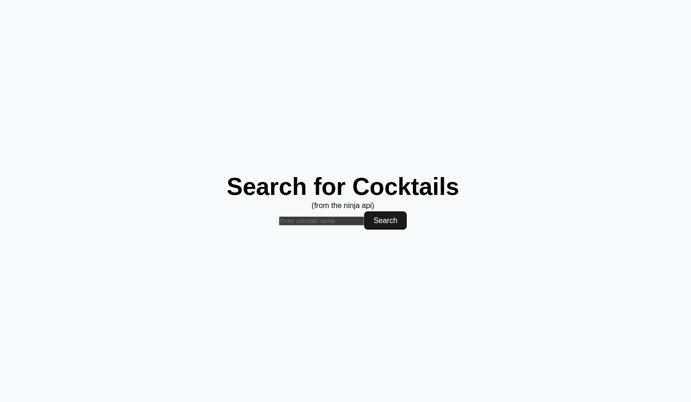
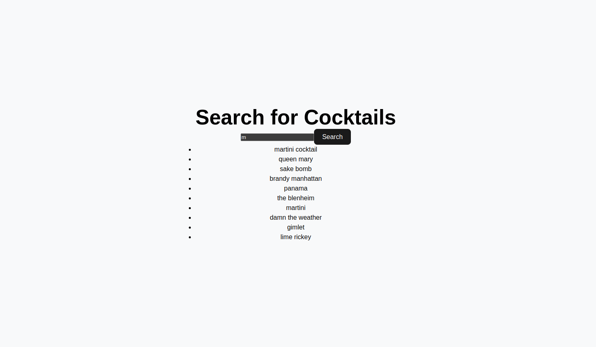
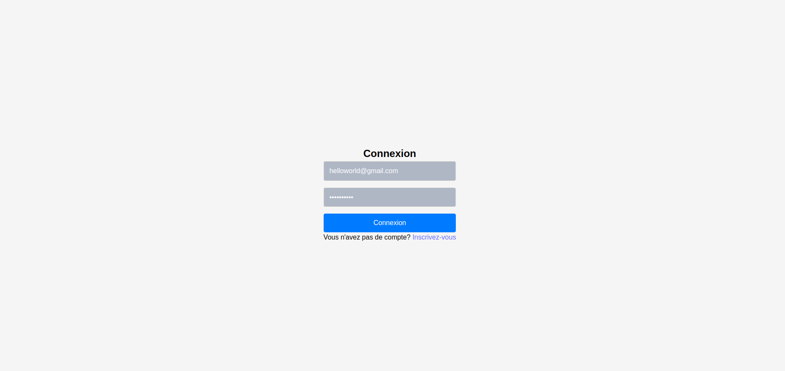
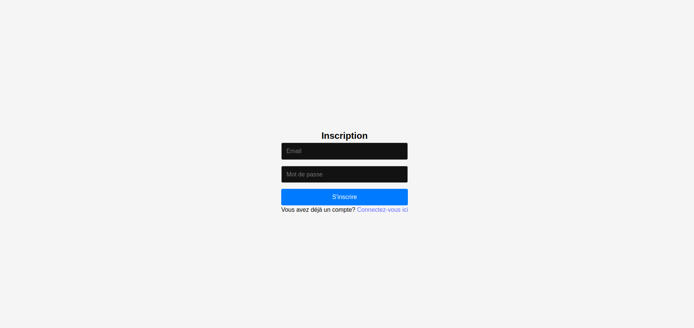
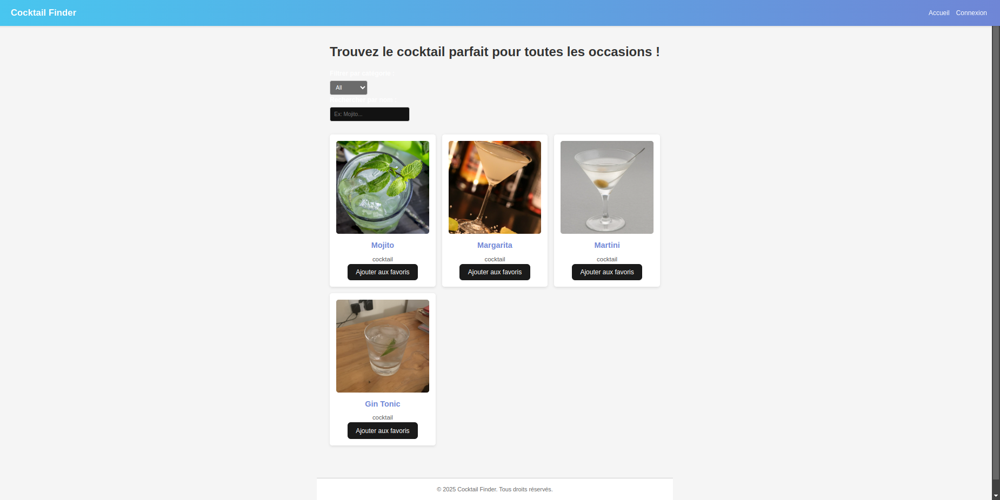
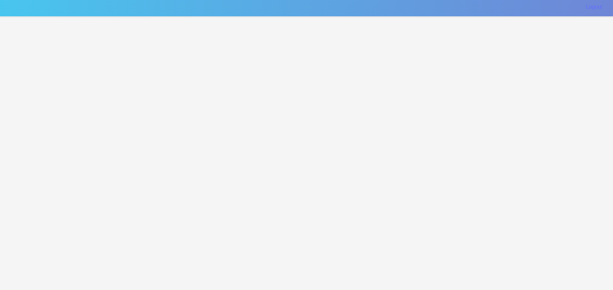
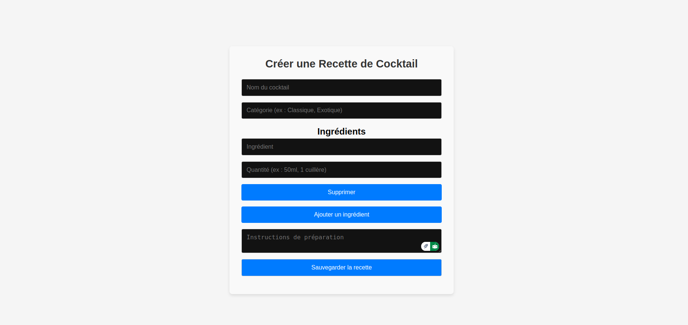

# Intégration de l'API Ninja

http://localhost:4000/search


Search.


Example.



--

# Cocktail Finder 

-   L'application est construite avec MERN Stack (Mongo, Express, ReactJs, NodeJS) et Nginx - Docker - Docker Compose

-   Lorsqu'elle est exécutée avec `docker-compose`, elle dispose d'un conteneur Nginx ayant pour objectif de faire un `reverse-proxy` vers les conteneurs ReactJs ou NodeJs ; de cette manière, la coexistence des différentes requêtes est assurée avec `docker-compose`

-   La base de données Mongo se charge automatiquement dans le `docker-compose`

## Configuration

### Configuration du projet

1. **Cloner le dépôt** :
   ```bash
   git clone git@github.com:henni-yousra/CocktailWeb.git
   ```

### Installer les dépendances
   ```bash
cd CocktailWeb
docker-compose -f docker-compose.dev.yml up --build
   ```
Accédez à l'application [ App ](http://localhost:4000/)

➜  Local :   http://localhost:4000/
➜  Réseau : http://172.18.0.5:4000/

# accéder à la base de données

   ```bash
docker exec -it mongodb mongosh
use cocktaildb
db.users.find({}, { email:1 , password:1 });
   ```

## Captures d'écran

Connexion.

S
Inscription.


Accueil.


Tableau de bord.


Formulaire pour Créer une Recette de Cocktail.
